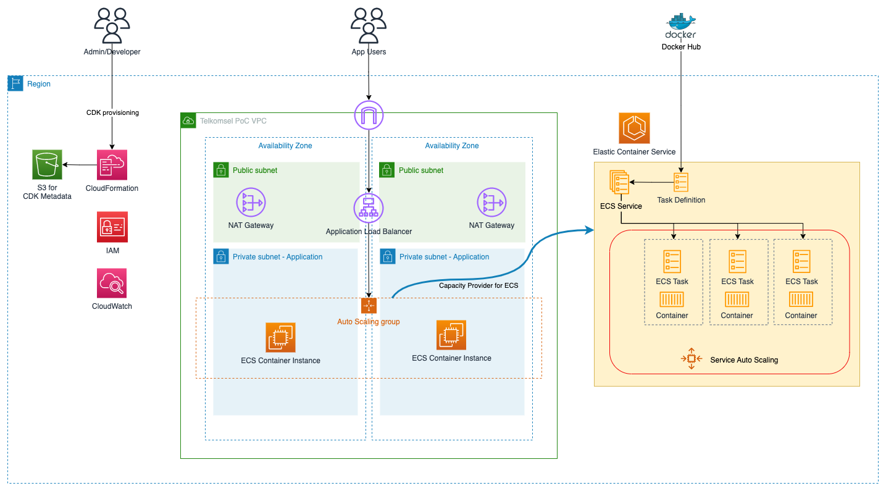
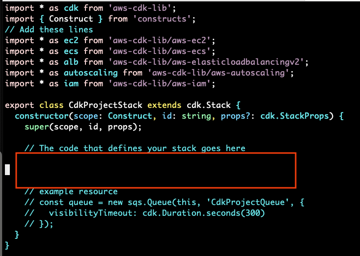
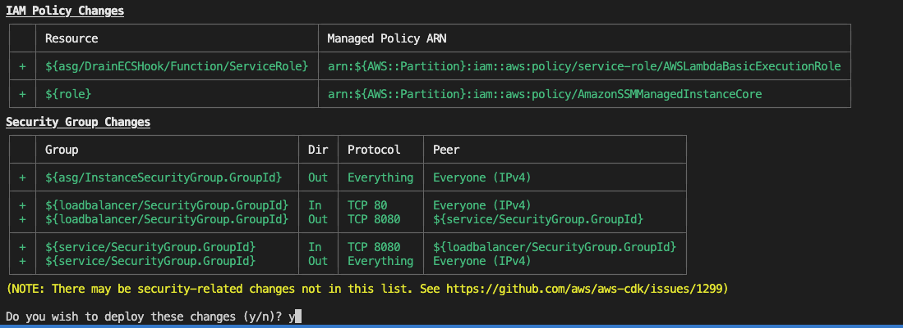
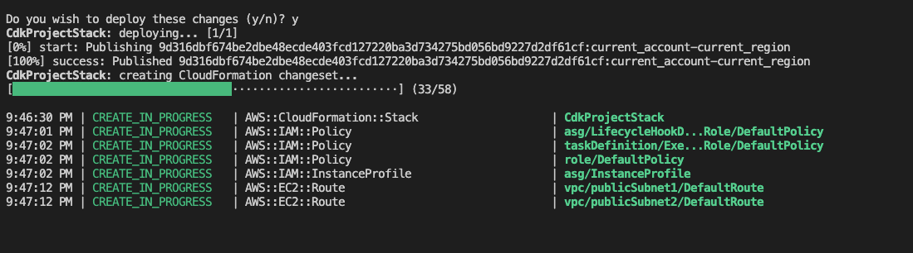
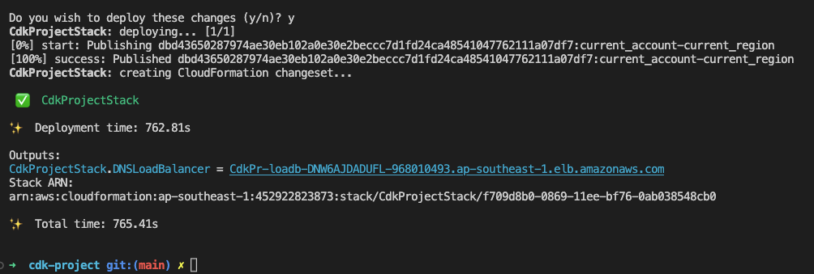

# Deploy Docker Image to ECS Cluster using AWS CDK version 2

In this document we will show how to use AWS CDK (Cloud Development Kit) version 2 to deploy a simple Docker image to Amazon Elastic Container Service (ECS) cluster. The architecture of this environment described in the following diagram:




This stack will create the following resources:

1. Virtual Private Cloud (VPC) with public & private subnet, and the NAT Gateway.
2. ECS Cluster.
3. EC2 Auto Scaling Group as ECS Capacity Provider.
4. Application Load Balancer & the target group.
5. ECS Service with the following characteristics:
    - Networking type `awsvpc`, this will give every task its own network interface & IP address.
    - Logging using AWS Log Driver `awslog` with Non-blocking mode.
    - Container image is taken from public Docker Hub account.
    - Service auto scaling.


If you want to quickly deploy this stack, just run the **Prerequisites** section and execute these commands:

```
git clone https://github.com/ttirtawi/cdk-template-ecs-on-ec2.git
cd cdk-template-ecs-on-ec2
cdk deploy
```

Please follow along if you want to know each step below.

## 🚀 Prerequisites

For the demo I'll use Amazon Linux 2 environment. You can use any other operating system as well. Lets complete some prerequisite below:

1. Install AWS CLI as described in this link. Below is the sample command for Linux (x86):

    ```
    curl "https://awscli.amazonaws.com/awscli-exe-linux-x86_64.zip" -o "awscliv2.zip"
    unzip awscliv2.zip
    sudo ./aws/install
    ```

2. Install AWS CDK as described in this document. We will use AWS CDK version 2.

    ```
    npm install -g aws-cdk@2
    ```

    As I write this document, CDK v2 latest version is 2.3.0. Test your CDK installation using the following command:

    ```
    cdk --version
    ```

3. You also need AWS credentials (using IAM access/secret key or using EC2 instance role). Use `aws configure` to setup default AWS region & access/secret key. Please remember that your account/role must have sufficient permission to provison AWS resources (e.g. `AdministratorAccess`).

4. It is recommended to use code editor like Visual Code Studio to navigate the CDK's modules easily.


## 🚀 Prepare CDK stack class


1. Create new project folder.

    ```
    mkdir ~/cdk-project
    cd ~/cdk-project
    ```

2. Initialize CDK environment in the new project. You can select your preferred programming language like Python, Typescript, Java (see [CDK documentation](https://docs.aws.amazon.com/cdk/latest/guide/home.html) for more detail). I'll use Typescript for the rest of this document.

    ```
    cdk init --language=typescript
    ```
  
3. Open `lib/cdk-project-stack.ts`, the default contents will looks like this screenshot.  

    ```
    import { Stack, StackProps } from 'aws-cdk-lib';
    import { Construct } from 'constructs';
    // import * as sqs from 'aws-cdk-lib/aws-sqs';

    export class TestStack extends Stack {
      constructor(scope: Construct, id: string, props?: StackProps) {
        super(scope, id, props);

        // The code that defines your stack goes here

        // example resource
        // const queue = new sqs.Queue(this, 'TestQueue', {
        //   visibilityTimeout: cdk.Duration.seconds(300)
        // });
      }
    }

    ```

4. Add the following code on the very top of `lib/cdk-project-stack.ts` (under Construct) to import all required modules. With CDK v2 we don't need to install each module manually, we just need to import from `aws-cdk-lib`:

    ```
    import { Stack, StackProps, RemovalPolicy, CfnOutput } from 'aws-cdk-lib';
    import { Construct } from 'constructs';
    
    // Add these lines
    import * as ec2 from 'aws-cdk-lib/aws-ec2';
    import * as ecs from 'aws-cdk-lib/aws-ecs';
    import * as alb from 'aws-cdk-lib/aws-elasticloadbalancingv2';
    import * as autoscaling from 'aws-cdk-lib/aws-autoscaling';
    import * as iam from 'aws-cdk-lib/aws-iam';
    ```

5. We will added the code step by step throughout this document. We will add the code into the red box area as shown in the following screenshot: 
    
    


### 🔥 Setup VPC

1. We will create new VPC (Virtual Private Cloud):

    ```
    // Create new VPC
    const vpc = new ec2.Vpc(this, 'vpc', {
      ipAddresses: ec2.IpAddresses.cidr('172.33.0.0/16'), //****MODIFY AS REQUIRED****//
      maxAzs: 2, //****MODIFY AS REQUIRED****//
      subnetConfiguration: [
        {
          cidrMask: 24, //****MODIFY AS REQUIRED****//
          name: 'public',
          subnetType: ec2.SubnetType.PUBLIC,
        },
        {
          cidrMask: 22, //****MODIFY AS REQUIRED****//
          name: 'private-nat',
          subnetType: ec2.SubnetType.PRIVATE_WITH_EGRESS,
        }
      ]
    });
    ```

    The code snippet above will do the following:

    1. Create new VPC with CIDR range 172.33.0.0/16 across 2 Availability Zones (AZs). You can modify the value of CIDR & number of required AZs.
    2. Create new Internet Gateway and attach it to the VPC.
    3. Create 2 Public Subnets (default route to Internet Gateway) across 2 Availability Zones. This example set each Public Subnet to have /24 segment. You can modify as needed.
    4. Create new NAT Gateway in each Availability Zone (with `maxAzs` we define only 2 Availability Zones being used).
    5. Create 2 Private Subnet (default route to NAT Gateway) across 2 Availability Zones. This example set each Public Subnet to have /22 segment. You can modify as needed.


### 🔥 Setup Elastic Container Service

There are few steps to create and configure the Elastic Container Service. In this section we will create ECS Cluster that will use EC2 as the compute engine a.k.a *container instance* (the server that will run container runtime). ECS also has another way to run the container using AWS Fargate (serverless compute engine).

1. We start by creating new ECS cluster using the following code:

    ```
    // Create ECS Cluster
    const cluster = new ecs.Cluster(this, 'myECSCluster', {
      vpc: vpc
    });
    ```

    The cluster creation only needs 1 mandatory argument which is the VPC object. Optionally you can also set the cluster name. In this sample we will let the CDK generate the name for us.

2. (Optional) in this step we will define IAM role (with managed policy `AmazonSSMManagedInstanceCore` so that we can reach the instance using SSM Session Manager) for all EC2 instances:

    ```
    // Create IAM Role for EC2 instances
    const role = new iam.Role(this, 'role', {
      assumedBy: new iam.ServicePrincipal('ec2.amazonaws.com'),
      managedPolicies: [
        iam.ManagedPolicy.fromAwsManagedPolicyName('AmazonSSMManagedInstanceCore'),
      ],
    });
    ```

3. Next we will prepare EC2 Auto Scaling Group that will manage capacity & lifecycle of the container instances. Add the following code to create new Auto Scaling Group:

    ```
    // Create EC2 Auto Scaling Group
    const autoScalingGroup = new autoscaling.AutoScalingGroup(this, 'asg', {
      vpc,
      instanceType: new ec2.InstanceType('m6g.xlarge'),  //****MODIFY AS REQUIRED****//
      machineImage: ecs.EcsOptimizedImage.amazonLinux2(
        ecs.AmiHardwareType.ARM
        //****MODIFY AS REQUIRED (use STANDARD for Intel instance and ARM for Graviton instance)****//
      ),
      minCapacity: 1,
      maxCapacity: 5,
      desiredCapacity: 2,
      role,
    });
    ```
    Some explanation regarding this new Auto Scaling Group: 
    
      - It will use Graviton EC2 instance type `m6g.xlarge` (4 vCPU, 16GB RAM) with Amazon Linux 2 operating system (ECS optimized version). 
      - If you want to use Intel processor instead, change the instance type (for example to `m5.xlarge`) and also `ecs.AmiHardwareType.ARM` to `ecs.AmiHardwareType.STANDARD`
      - We set the group capacity with 1 instance at the start and let the Auto Scaling to adjust the capacity with 5 instance at the maximum.
      - We tell the Auto Scaling Group to be launched in the same VPC we had prepared before. By default Auto Scaling Group will launch the EC2 in private subnets only. Optionally you can specify the subnet using `vpcSubnets` attribute. 
      - We attach IAM role that we created before.

4. Then we need to register the Auto Scaling Group to ECS Cluster as the capacity provider. Add the following code accordingly:

    ```
    // Create EC2 Capacity Provider
    const capacityProvider = new ecs.AsgCapacityProvider(this, 'asgCapacityProvider',{
      autoScalingGroup,
      enableManagedTerminationProtection: false,
      enableManagedScaling: true
    });

    // Attach Capacity Provider to ECS Cluster
    cluster.addAsgCapacityProvider(capacityProvider);
    ```

    Notes: the option `enableManagedTerminationProtection: false` should not be used in Production environment. This is temporary workaround to let CDK destroy the stack completely (ref: [https://github.com/aws/aws-cdk/issues/14732](https://github.com/aws/aws-cdk/issues/14732)). Without this option CDK will not able to terminate Auto Scaling Group upon stack deletion.

5. Next we will prepare [Task Definition](https://docs.aws.amazon.com/AmazonECS/latest/developerguide/task_definitions.html). Task is the smallest deployment unit in ECS. It is similar with Pod concept in Kubernetes. Each Task can have minimum  1 or more containers. Add the following code accordingly:

    ```
    // Prepare Port Mapping
    var demoPortMapping: ecs.PortMapping[] = [];
    demoPortMapping.push({
      containerPort: 8080,  //****MODIFY AS REQUIRED****//
      protocol: ecs.Protocol.TCP
    });

    // Create Task Definition
    const taskDefinition = new ecs.Ec2TaskDefinition(this, 'taskDefinition', {
      networkMode: ecs.NetworkMode.AWS_VPC
    });

    // Add Container to the Task Definition
    const container = taskDefinition.addContainer('web', {
      image: ecs.ContainerImage.fromRegistry('tedytirta/demo-docker-ecs'),  
      //****MODIFY AS REQUIRED USING YOUR DOCKER IMAGE****//
      portMappings: demoPortMapping,
      memoryReservationMiB: 256,  //****MODIFY AS REQUIRED****//
      logging: new ecs.AwsLogDriver({
        streamPrefix: 'ECSLogGroup',  //****MODIFY AS REQUIRED****//
        mode: ecs.AwsLogDriverMode.NON_BLOCKING
      }),
      environment: {
        "TITLE": "Docker on ECS with Graviton EC2"
      },
    });
    ```

    Here is the explanation for each section of the code above:
    - We create Port Mapping configuration which declare the port on which our container will be listened at. The sample container image in this demo will listen at TCP port 8080. Adjust the port based on your Docker image specification.
    - We create Task Definition that will use AWS VPC as networking component. It means that every Task will have its own Elastic Network Interface and its VPC IP address. So each Task will inherit all VPC's capability such as NACL, Security Group, as wel as routing capability.
    - Then the main activity is to define container specification 
      - Container image location
      - Port mapping configuration
      - Memory reservation: in this sample we set to 256MiB, you can modify as needed.
      - Logging mode: in this sample we set the CloudWatch Log Group with stream name prefixed with `ECSLogGroup`.
      - Environment variables
  

6. After we have Task Definition, we will create ECS Service. Add the following code accordingly:

    ```
    // Create ECS Service
    const ecsService = new ecs.Ec2Service(this, 'service', {
      cluster: cluster,
      taskDefinition: taskDefinition,
      assignPublicIp: false,
      desiredCount: 5,  //****MODIFY AS REQUIRED****//
      capacityProviderStrategies: [
        {
          capacityProvider: capacityProvider.capacityProviderName,
          weight: 1
        },
      ]
    })
    ```
    
    Basically code snippet above are doing the following:
    
    1. Specify the service specification, that will link together Task Definition, Cluster, and Capacity Provider. 
    2. Setting desired number of Task to 5. You can modify the value as needed.

### 🔥 Setup Application Load Balancer

1. We will create internet facing Application Load Balancer:
   
    ```
    // Create Application Load Balancer
    const lb = new alb.ApplicationLoadBalancer(this, 'loadbalancer', {
      vpc,
      internetFacing: true,
    });
    ```

2. Then we will create HTTP listener in the load balancer. 
   
    ```
    // Create Application Load Balancer HTTP Listener
    const listener = lb.addListener('httpListener', {
      port: 80 
    });
    ```
  
    CDK will automatically create security group for ALB with inbound port 80 allow connection from internet (0.0.0.0). 

3. Create Application Load Balancer HTTP Target Group and associate our ECS Service.

    ```
    // Create Target Group and Attach ECS Service
    const targetGroup = new alb.ApplicationTargetGroup(this, 'targetGroup', {
      vpc,
      port: 80,
      protocol: alb.ApplicationProtocol.HTTP,
      targetType: alb.TargetType.IP
    })
    
    ecsService.attachToApplicationTargetGroup(targetGroup)
    ```

4. Finally we will configure HTTP listener to forward the traffic to the ECS Service we created before.

    ```
    // Configure listener to forward traffic to the Target Group
    listener.addTargetGroups('addtargetgroup', {
      targetGroups: [targetGroup]
    }) 
    ```

    CDK will automatically add inbound rule to allow incoming request to port 80 from Load Balancer only.

### 🔥 Configure ECS Service Auto Scaling

1. We will enable auto scaling for ECS service.

    ```
    const serviceAutoScaling = ecsService.autoScaleTaskCount({
      maxCapacity: 20  //****MODIFY AS REQUIRED****//
    })
    ```
    In this sample we set the service to scale to maximum 20 tasks. You can adjust the maximum tasks required as needed.

2. Then we need to create the scaling policy.

    ```
    serviceAutoScaling.scaleOnRequestCount('scaleOnRequestCount', {
      requestsPerTarget: 100,  //****MODIFY AS REQUIRED****//
      targetGroup
    })
    ```

    In this sample we use Target Tracking policy and choose ALB Request Count as the metric. This policy will monitor the number of request per target and scale the Task if value exceed 100.

### 🔥 Define the output

This is optional section. We will configure CDK to generate the output of Application Load Balancer's DNS Name:

```
// Output
new cdk.CfnOutput(this, 'DNSLoadBalancer', {value: lb.loadBalancerDnsName});
```

This is the last code we added to the `lib/cdk-stack.ts` file.


## 🚀 Deploy CDK Stack

After we add all required codes that made up our CDK stack, follow these steps to deploy the stack to AWS region:

1. Run `cdk bootstrap` to prepare initial resource which will be used by CDK to provision our stack. This step will create new CloudFormation stack named `CDKToolkit` that will include S3 bucket creation and IAM role setup (by default it will use your AWS profile privileges, you can optionally define different set of IAM policies for the CDK). Bootstrap process must be done in each region you want to use.

2. Run `cdk synth` to let CDK generate CloudFormation template based on our stack.

3. To deploy CDK stack run the following command. 

    ```
    cdk deploy 
    ```

    (Optional) to deploy on different account or region, use this command:

    ```
    cdk deploy --context accountId=<AWS_ACCOUNT_ID> --context region=<AWS_REGION>
    ```

    Enter `y` to continue. See the sample output below:

    

4. It will takes 15-20 minutes to complete the deployment. You will see the progress like the following sample:

    

    You can also monitor the CloudFormation stack creation using the following command (default stack name in this example is `CdkProjectStack`):

    ```
    while true
    do
      aws cloudformation describe-stacks --stack-name CdkProjectStack --query 'Stacks[].StackStatus' --output text
      sleep 5
    done
    ```

    There are multiple possible output such as:

    1. `CREATE_IN_PROGRESS`: resources creation process still ongoing.
    2. `CREATE_COMPLETE`: CloudFormation already finished created all the resources.
    3. `ROLLBACK_COMPLETE`: some error happen during resource creation. If you encounter this message, double check the event that cause the error & fix the CDK stack accordingly.

      
5. When the provisioning process completed, you will see the output similar like this:

    

6. Test by opening Load Balancer domain (`DNSLoadBalancer` value) in the web browser. If everything works perfectly, you will see the following page:
  
    

Congratulation, you have just completed the demo. You already able to deploy containerized web application into ECS Cluster.


## 🚀 Cleanup

After finish the testing, don't forget to clean up the resources to avoid unnecessary billing charges. You can use `cdk destroy` command to clean up the deployment. The command will delete CloudFormation stack and automatically delete all the resources that we already created earlier.

If for some reason you get some error during deletion process, you can visit AWS CloudFormation console to get more details. You can refer to [this documentation](https://aws.amazon.com/premiumsupport/knowledge-center/cloudformation-stack-delete-failed/) if you encounter stack deletion issue.
